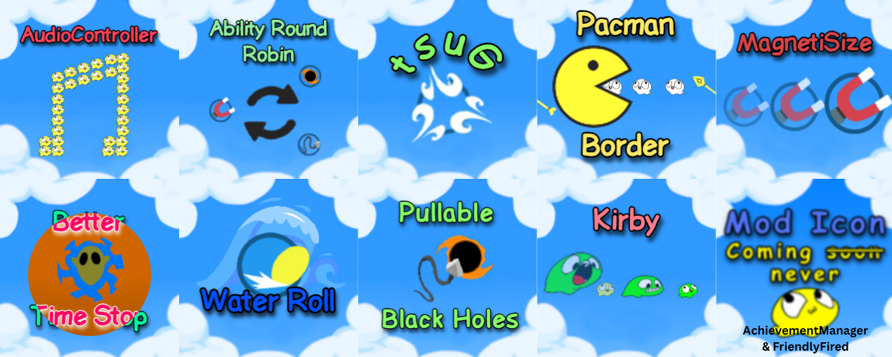

# MyBoplMods
A centralized collection of engine patches, physics modifications, and custom state managers built for the indie title Bopl Battle.

---

## General Information

*small preface: Bopl Battle is a game that uses a pure P2P communication rather than a client-server communication. As a result, there is no master client or server that updates everyone else; each game runs its own simulation of what is supposed to happen. Because any slight mismatch can cause a ton of desync, these mods have to track individual player IDs perfectly, and every player in a lobby needs the mod installed.*

**Impact and Outreach:** My 11 mods contribute to the modding community in a very major way. The amount of mods on thunderstore *widley considered the modding community* total 261, accounting for my 11 mods that is ~4.2% of the total mod count. Through these 261 mods, there have been 2,791,372 total downloads, my mods account for 135,942 of these downloads or roughly 5%. Thus, my mods have contributed a very large impact to the community and users genuinley enjoy them.  

**Architecture:** Developed using C# and Harmony bytecode patching to hook into the Unity game engine's runtime loop and manipulate the game's CIL (Common Intermediate Language) through BepInEx.

**Examples:** Most mods have examples of usage available on github *(the individual repos)* and my [youtube channel](https://www.youtube.com/@maxgamertyper1)

---

## Community Recognition
* **Official Competitive Integration:** 2 of the 22 total mods featured in the official **Bopl Battle Competitive Modpack** (`WaterRoll` and `PacmanBorder`) were developed by me, establishing these frameworks as core standards for tournament play.
* **Community Standardization:** While the community had some standards when making mods, they were very lax and were not inviting to new community members. As a result, I wanted to change the community to have more formally designed mod icons *(see below)*. In the past year or two, the community has moved more toward professional mod icons, and it looks incredible now. Additionally, many mods at the time were not configurable, and they overlapped each other a lot. I wanted to ensure that I made my mods modular and configurable so that players can use multiple mods at once and configure them for the maximum amount of entertainment.

---

## Mods by Classification

### 1. Physics and Projectile Manipulation

#### [PacmanBorder](https://thunderstore.io/c/bopl-battle/p/maxgamertyper1/PacmanBorder/)
Modified the game's boundary system to implement seamless screen-wrapping (like Pac-Man). When a player or item hits the screen edge, the object instantly translates their position to the opposite border while fully preserving their velocity and momentum.
*this only applies to horizontal movements as vertical-wrapping would cause entities to live forever*

* **Simple Breakdown:** For projectiles and objects, the update method is modified so that if the item is out of bounds, its position is updated to have the same x-position as the other side while maintaining y-position and velocity. For raycasts, when the weapon is shot, if the ray goes out of bounds, the particle beam and the remaining distance is copied as another cast over to the other boundary of the map.
* **Harmony Uses:** Prefix *- full overrides, which I now know aren't good and can cause many issues*
* **[Source Code](https://github.com/maxgamertyper/PacmanBopl)**

#### [PullableBlackHoles](https://thunderstore.io/c/bopl-battle/p/maxgamertyper1/PullableBlackHoles/)
Altered the BlackHole game class to modify the interactions between the grappling hook item and the black hole.

* **Simple Breakdown:** modifies the blackHole class's internal update to alter the default interactions it has with the grappling hook, which are adjustable in a separate config file.
* **Harmony Tools:** Prefix
* **[Source Code](https://github.com/maxgamertyper/PullableBlackHoles)**

#### [WaterRoll](https://thunderstore.io/c/bopl-battle/p/maxgamertyper1/WaterRoll/)
Adjusts the game's Roll ability to allow it to survive inside of the game's bottom vertical bound (water). To ensure fairness, this has a config file that allows for stalemate (where a person is stuck underwater) prevention with a customizable time and "Water Boost" which allows players to get pushed out of the water when the ability ends.

* **Simple Breakdown:** By default it disables the kill bounds for the player while the roll ability is active. With the addition of V2.0 Anti-stalemate and Water Boost were added. When enabled, Anti-stalemate creates a dictionary that links each player to a double value that updates every frame with the time the frame took, once this double reaches a set threshold, the player is then killed. Water boost works by checking if the player is under the map bounds and if they are found to be, they are given extra ability time to get in-bounds.
* **Harmony Tools:** Prefix and Postfix
* **[Source Code](https://github.com/maxgamertyper/Water-Roll)**

#### [MagnetiSize](https://thunderstore.io/c/bopl-battle/p/maxgamertyper1/MagnetiSize/)
Injected logic into the Magnet class to account for player size when applying ability effects

* **Simple Breakdown:** Changes the strength of effects by applying the modifier of game size before the effects are applied
* **Harmony Tools:** Prefix
* **[Source Code](https://github.com/maxgamertyper/MagnetiSize)**

#### [Suck / tsuG](https://thunderstore.io/c/bopl-battle/p/maxgamertyper1/tsuG/)
Inverts the physical repulsion of the gust ability into an attraction

* **Simple Breakdown:** multiplies the effect vector by -1 (super simple i know, but super fun still)
* **Harmony Tools:** Prefix
* **[Source Code](https://github.com/maxgamertyper/Bopl-Suck)**

---

### 2. Game State & Logic Manipulation

*these mods partially use transpilers as they are very core game mechanics*

#### [Kirby](https://thunderstore.io/c/bopl-battle/p/maxgamertyper1/Kirby/)
Allows for player state copying and customizations when 'munching' another player

* **Simple Breakdown:** Ensures that the player is in their last life and then copies their abilities, player color, and size (all configurable) through complex ways of setting data. Disables the drop mechanics for the dead player to make sure no abilities are overwritten.
* **Harmony Tools:** Prefix
* **[Source Code](https://github.com/maxgamertyper/KirbyBopl)**

#### [AbilityRoundRobin](https://thunderstore.io/c/bopl-battle/p/maxgamertyper1/AbilityRoundRobin/)
Modifies the ways abilities are picked up to a round-robin system instead of a set system

* **Simple Breakdown:** Uses CIL (Common Intermediate Language) injection to modify the functionality of certain functions without completely overriding them. By checking for simple if branches and constant loads, a static function call is included to run my custom code that updates the ability slot. Later, the literal load is replaced with a variable load to the new index.
* **Harmony Tools:** Transpiler
* **[Source Code](https://github.com/maxgamertyper/AbilityRoundRobinBopl)**

#### [BetterTimeStop](https://thunderstore.io/c/bopl-battle/p/maxgamertyper1/BetterTimeStop/)
Adjusts the Timestop ability to have a duration for as long as its charged for

* **Simple Breakdown:** Overrides CIL bytecode to have a maximum limit set to a configurable variable where the time is automatically stopped when reached. Otherwise uses a dictionary to track a player's charging time and then uses that as the length of the timestop.
* **Harmony Tools:** PostFix and Transpiler
* **[Source Code](https://github.com/maxgamertyper/BetterTimeStop/tree/main)**

#### [FriendlyFired](https://thunderstore.io/c/bopl-battle/p/maxgamertyper1/FriendlyFired/)
Disables the hurtbox and 'pullbox' (black holes) of certain abilities for the owner of that ability

* **Simple Breakdown:** When an object awakes, it is then looked at to view if the current player is the owner, if so it disables the hurt and/or pull box for that specific player. Very customizable with any ability being able to be disabled or enabled
* **Harmony Tools:** Prefix
* **[Source Code](https://github.com/maxgamertyper/Friendly-Fired)**

---

### I/O & Network Modifications

#### [AudioController](https://thunderstore.io/c/bopl-battle/p/maxgamertyper1/AudioController/)
enables you to change which audio is playing during a match, allows for custom mp3s to be imported into the game

* **Simple Breakdown:** Prefetches mp3 files as Unity audio files and then converts them to an AudioClip class (Bopl relies on this) which is then pushed into an AudioManager class that allows for easy organization and management (i.e: volume level, skip, previous, loop, loop each once, random, etc).
* **Harmony Tools:** Prefix and Postfix
* **[Source Code](https://github.com/maxgamertyper/BoplAudioController)**

#### [AchievementManager](https://thunderstore.io/c/bopl-battle/p/maxgamertyper1/AchievementManager/)
Simple mod that gives or removes all the steam achievements *made on a bet i couldn't do it quickly which i won*

* **Simple Breakdown:** Uses the steam API in the game to detect all achievements and then either gives or removes them based on a config setting
* **Harmony Tools:** Prefix
* **[Source Code](https://github.com/maxgamertyper/AchievementManager)**

